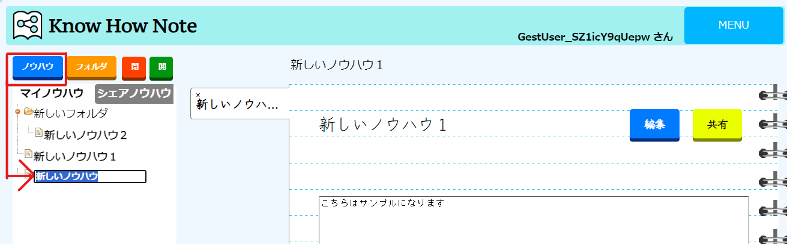
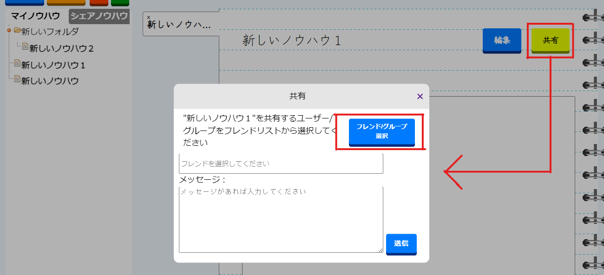
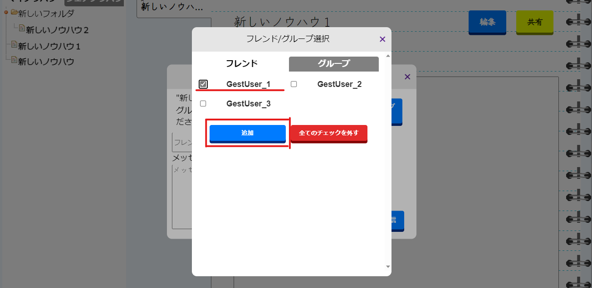
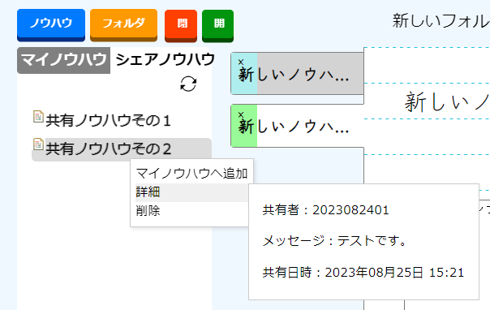
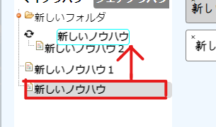
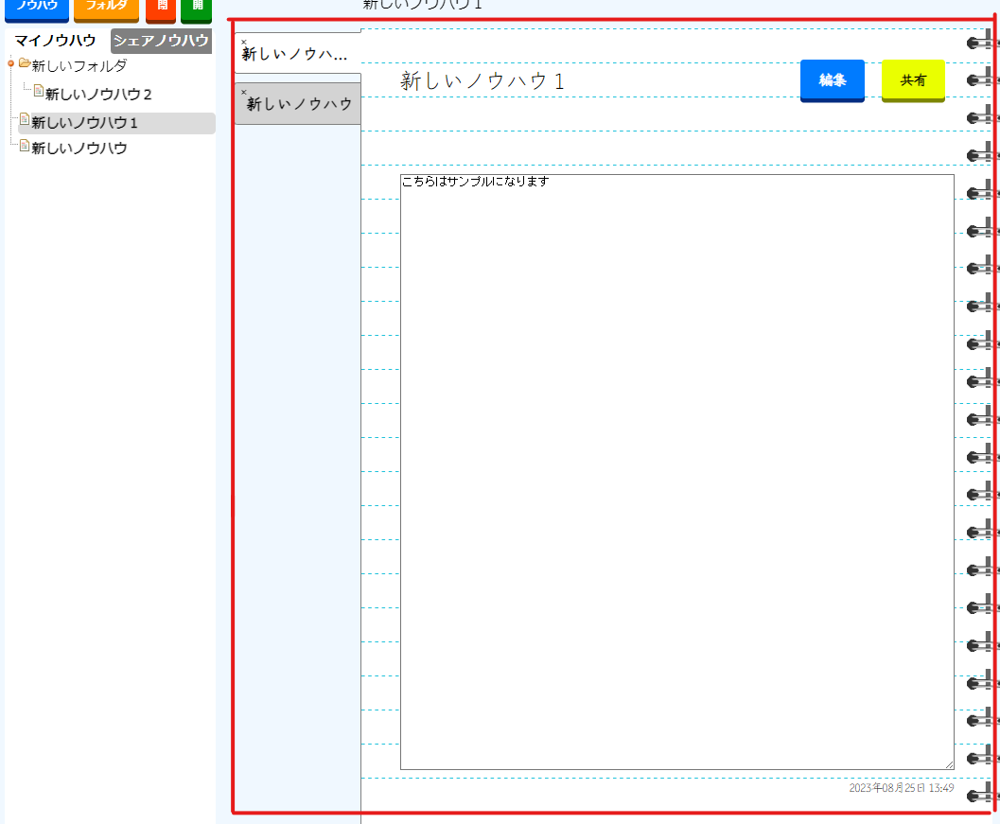
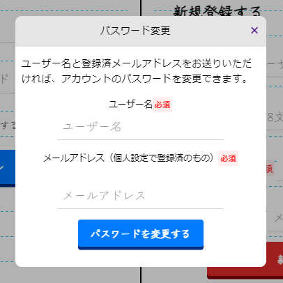
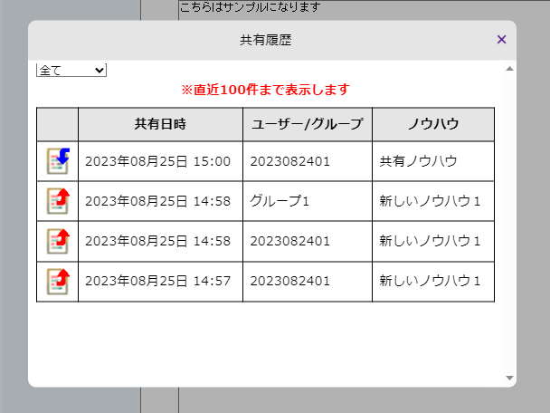
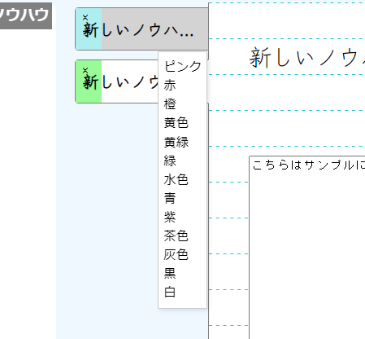
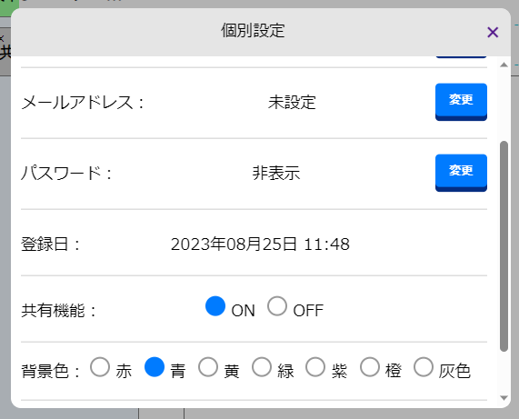

## Know How Note 　(2023.9)

### **https://knowhownote-106672fa32dd.herokuapp.com/**

## サービス概要

業務で得たノウハウや学びを一括管理し、フレンドに共有することのできる Web サービスです。

相手の「利用者 ID」を登録することによりフレンドへの追加が可能で、個人で作成したノウハウを共有し合うことができます。また、独自のグループを作成することにより、グループへ配属されたフレンド全員へ一括共有することも可能です。

業務内や学習の中で得たノウハウを管理することは非常に大事なことです。ノウハウを効果的に蓄積・共有すれば、「業務効率化・生産性向上」に繋がりますし、学習したことを復習として学び直すことにより「記憶の定着」に繋がります。「どこでノウハウを管理していたか忘れてしまった・・・」「ノウハウを簡単に共有出来るようにしたい」そんな方にお勧めの、直感的にノウハウを蓄積・管理・共有できる Web サービスです。

## メイン機能

**1.ノウハウの作成**  
「ノウハウ追加」、「フォルダ追加」ボタンからそれぞれノウハウ・フォルダを作成し、フォルダごとにまとめて一括管理することが可能です。  
フォルダのコンテキストメニューからもノウハウ・フォルダそれぞれ作成可能で、対象のフォルダの配下に作成されます。

|  |
| :-----------------------------------------------------: |
|                      ノウハウ作成                       |

**2.ノウハウの共有**  
作成したノウハウはメッセージを添えて「共有」ボタンから任意のユーザーに共有可能です。グループを選択した際にはグループに配属しているユーザーにも共有可能になります。  

|  |  |
| :-------------------------------------------------: | :---------------------------------------------------------: |
|                     共有ボタン                      |                       フレンドリスト                        |

共有されたノウハウは、右側リストの「シェアノウハウ」タブへ追加され、コンテキストメニューの「マイノウハウへ追加」を押下時にマイノウハウへ追加されます。 

|  |
| :---------------------------------------------------------------------------------------------------: |
|                                    共有ノウハウ右クリックメニュー                                     |

**3.ノウハウ・フォルダの配置**  
ノウハウまたはフォルダをドラッグ&ドロップすることによりお好みの位置に配置することが可能です。  
移動したノウハウやフォルダはその位置が DB に保存されるため、次回以降後も同じ構成で使用することができます。

|  |
| :-------------------------------------------------------------------------: |
|                           ドラッグアンドドロップ                            |

**4.ノウハウの表示**  
作成したノウハウをクリックすることにより、タブが生成され、ノウハウの内容を確認することができます。  
右側のタブ画面から、ノウハウの「編集」「保存」「共有」が可能になり、右下に最終保存日付が表示されます。

|  |
| :---------------------------------------------: |
|                    タブ作成                     |

**5.ユーザー新規登録 & ユーザーログイン & パスワードリセット機能**  
TOP 画面から新規登録・ログイン・ゲストログイン・パスワードリセットを行う事ができます。フレンドの追加や利用者 ID の更新、パスワードとメールアドレスの更新以外は、未登録のゲストユーザーでも操作可能となっています。

|  |
| :---------------------------------------------------------: |
|                       パスワード変更                        |

**6.その他機能**  
ノウハウの共有履歴の確認やタブ・背景の配色変更、共有機能の ON/OFF が個別設定から変更が可能です。

|  |  |  |
| :---------------------------------------------: | :-----------------------------------------: | :---------------------------------------------: |
|                    共有履歴                     |                   タブ色                    |                    個別設定                     |

<!--
## 👀 全体的な仕組み

ここにシステムの図を入れる
-->

## 開発環境

- HTML
- CSS
- Javascriprt
  - jQuery
- Node.js (Express)
- MySQL
- HEROKU
- VSCode（Visual Studio Code）

## 画面仕様/画面遷移図

[Figma]https://www.figma.com/file/tWQotfqXduFKvUqG8kdO6k/%E3%83%8E%E3%82%A6%E3%83%8F%E3%82%A6%E3%83%8E%E3%83%BC_%E7%94%BB%E9%9D%A2%E4%BB%95%E6%A7%98%2F%E7%94%BB%E9%9D%A2%E9%81%B7%E7%A7%BB?type=design&node-id=0%3A1&mode=design&t=WK2vuTqV996VRYNG-1

## 🌐 App URL

### **https://knowhownote-106672fa32dd.herokuapp.com/**
